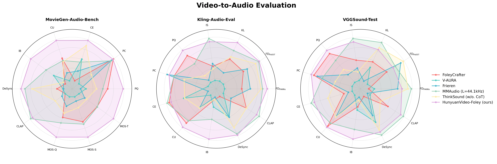

<div align="center">


<h4>Multimodal Diffusion with Representation Alignment for High-Fidelity Foley Audio Generation</h4>

<p align="center">
  <strong>Professional-grade AI sound effect generation for video content creators</strong>
</p>

<div align="center">
  <a href=https://github.com/Tencent-Hunyuan/HunyuanVideo-Foley target="_blank"></a>
  <a href=https://szczesnys.github.io/hunyuanvideo-foley target="_blank"></a>
  <a href=https://huggingface.co/tencent/HunyuanVideo-Foley target="_blank"></a>
  <a href=https://huggingface.co/spaces/tencent/HunyuanVideo-Foley  target="_blank"></a>
  <a href=https://arxiv.org/abs/2508.16930 target="_blank"></a>
  <a href=https://x.com/TencentHunyuan target="_blank"></a>
</div>

</div>

---

<div align="center">
  
### 👥 **Authors**

<div style="background: linear-gradient(135deg, #667eea 0%, #764ba2 100%); padding: 20px; border-radius: 15px; margin: 20px 0;">

**Sizhe Shan**<sup>1,2*</sup> • **Qiulin Li**<sup>1,3*</sup> • **Yutao Cui**<sup>1</sup> • **Miles Yang**<sup>1</sup>  • **Yuehai Wang**<sup>2</sup> • **Qun Yang**<sup>3</sup> • **Jin Zhou**<sup>1†</sup> • **Zhao Zhong**<sup>1</sup>

</div>

<div style="margin-top: 15px; font-size: 14px; color: #666;">
  
🏢 <sup>1</sup>**Tencent Hunyuan** • 🎓 <sup>2</sup>**Zhejiang University** • ✈️ <sup>3</sup>**Nanjing University of Aeronautics and Astronautics**

*Equal contribution • †Project lead

</div>

</div>


---

## 🎥 **Demo & Showcase**

<div align="center">
  
> **Experience the magic of AI-generated Foley audio in perfect sync with video content!**

<div style="border: 3px solid #4A90E2; border-radius: 15px; padding: 10px; margin: 20px 0; background: linear-gradient(135deg, #f5f7fa 0%, #c3cfe2 100%);">
  
  <video src="https://github.com/user-attachments/assets/d6e1b6fd-6980-4a68-8717-74298d064195" width="80%" controls style="border-radius: 10px; box-shadow: 0 8px 32px rgba(0,0,0,0.1);"> </video>
  
  <p><em>🎬 Watch how HunyuanVideo-Foley generates immersive sound effects synchronized with video content</em></p>
  
</div>

---

## 🤝 **Community Contributions**

<div style="background: #f8f9fa; padding: 20px; border-radius: 10px; border-left: 4px solid #28a745; margin: 20px 0; color: #333;">

**ComfyUI Integration** - Thanks to the amazing community for creating ComfyUI nodes:

- **[if-ai/ComfyUI_HunyuanVideoFoley](https://github.com/if-ai/ComfyUI_HunyuanVideoFoley)** - ComfyUI workflow integration which supports cpu offloading and FP8 quantization
- **[phazei/ComfyUI-HunyuanVideo-Foley](https://github.com/phazei/ComfyUI-HunyuanVideo-Foley)** - Alternative ComfyUI node implementation which supports different precision modes

</div>

<div align="center" style="margin: 20px 0;">
  
**🌟 We encourage and appreciate community contributions that make HunyuanVideo-Foley more accessible!**

</div>

---
### ✨ **Key Highlights**

<table align="center" style="border: none; margin: 20px 0;">
<tr>
<td align="center" width="33%">
  
🎭 **Multi-scenario Sync**  
High-quality audio synchronized with complex video scenes

</td>
<td align="center" width="33%">
  
🧠 **Multi-modal Balance**  
Perfect harmony between visual and textual information

</td>
<td align="center" width="33%">
  
🎵 **48kHz Hi-Fi Output**  
Professional-grade audio generation with crystal clarity

</td>
</tr>
</table>

</div>

---

## 📄 **Abstract**

<div align="center" style="background: linear-gradient(135deg, #ffeef8 0%, #f0f8ff 100%); padding: 30px; border-radius: 20px; margin: 20px 0; border-left: 5px solid #ff6b9d; color: #333;">

**🚀 Tencent Hunyuan** open-sources **HunyuanVideo-Foley** an end-to-end video sound effect generation model! 

*A professional-grade AI tool specifically designed for video content creators, widely applicable to diverse scenarios including short video creation, film production, advertising creativity, and game development.*

</div>

### 🎯 **Core Highlights**

<div style="display: grid; grid-template-columns: 1fr; gap: 15px; margin: 20px 0;">

<div style="border-left: 4px solid #4CAF50; padding: 15px; background: #f8f9fa; border-radius: 8px; color: #333;">
  
**🎬 Multi-scenario Audio-Visual Synchronization**  
Supports generating high-quality audio that is synchronized and semantically aligned with complex video scenes, enhancing realism and immersive experience for film/TV and gaming applications.

</div>

<div style="border-left: 4px solid #2196F3; padding: 15px; background: #f8f9fa; border-radius: 8px; color: #333;">
  
**⚖️ Multi-modal Semantic Balance**  
Intelligently balances visual and textual information analysis, comprehensively orchestrates sound effect elements, avoids one-sided generation, and meets personalized dubbing requirements.

</div>

<div style="border-left: 4px solid #FF9800; padding: 15px; background: #f8f9fa; border-radius: 8px; color: #333;">
  
**🎵 High-fidelity Audio Output**  
Self-developed 48kHz audio VAE perfectly reconstructs sound effects, music, and vocals, achieving professional-grade audio generation quality.

</div>

</div>

<div align="center" style="background: linear-gradient(135deg, #667eea 0%, #764ba2 100%); color: white; padding: 20px; border-radius: 15px; margin: 20px 0; color: #333;">
  
**🏆 SOTA Performance Achieved**

*HunyuanVideo-Foley comprehensively leads the field across multiple evaluation benchmarks, achieving new state-of-the-art levels in audio fidelity, visual-semantic alignment, temporal alignment, and distribution matching - surpassing all open-source solutions!*

</div>

<div align="center">
  

*📊 Performance comparison across different evaluation metrics - HunyuanVideo-Foley leads in all categories*

</div>

---

## 🔧 **Technical Architecture**

### 📊 **Data Pipeline Design**

<div align="center" style="margin: 20px 0; color: #333;">
  

*🔄 Comprehensive data processing pipeline for high-quality text-video-audio datasets*

</div>

<div style="background: #f8f9fa; padding: 20px; border-radius: 10px; border-left: 4px solid #17a2b8; margin: 20px 0;">

The **TV2A (Text-Video-to-Audio)** task presents a complex multimodal generation challenge requiring large-scale, high-quality datasets. Our comprehensive data pipeline systematically identifies and excludes unsuitable content to produce robust and generalizable audio generation capabilities.

</div>

### 🏗️ **Model Architecture**

<div align="center" style="margin: 20px 0; color: #333;">
  

*🧠 HunyuanVideo-Foley hybrid architecture with multimodal and unimodal transformer blocks*

</div>

<div style="background: #f8f9fa; padding: 20px; border-radius: 10px; border-left: 4px solid #28a745; margin: 20px 0;">

**HunyuanVideo-Foley** employs a sophisticated hybrid architecture:

- **🔄 Multimodal Transformer Blocks**: Process visual-audio streams simultaneously
- **🎵 Unimodal Transformer Blocks**: Focus on audio stream refinement
- **👁️ Visual Encoding**: Pre-trained encoder extracts visual features from video frames
- **📝 Text Processing**: Semantic features extracted via pre-trained text encoder  
- **🎧 Audio Encoding**: Latent representations with Gaussian noise perturbation
- **⏰ Temporal Alignment**: Synchformer-based frame-level synchronization with gated modulation

</div>

---

## 📈 **Performance Benchmarks**

### 🎬 **MovieGen-Audio-Bench Results**

<div align="center">
  
> *Objective and Subjective evaluation results demonstrating superior performance across all metrics*

</div>

<div style="overflow-x: auto; margin: 20px 0;">

| 🏆 **Method** | **PQ** ↑ | **PC** ↓ | **CE** ↑ | **CU** ↑ | **IB** ↑ | **DeSync** ↓ | **CLAP** ↑ | **MOS-Q** ↑ | **MOS-S** ↑ | **MOS-T** ↑ |
|:-------------:|:--------:|:--------:|:--------:|:--------:|:--------:|:-------------:|:-----------:|:------------:|:------------:|:------------:|
| FoleyGrafter | 6.27 | 2.72 | 3.34 | 5.68 | 0.17 | 1.29 | 0.14 | 3.36±0.78 | 3.54±0.88 | 3.46±0.95 |
| V-AURA | 5.82 | 4.30 | 3.63 | 5.11 | 0.23 | 1.38 | 0.14 | 2.55±0.97 | 2.60±1.20 | 2.70±1.37 |
| Frieren | 5.71 | 2.81 | 3.47 | 5.31 | 0.18 | 1.39 | 0.16 | 2.92±0.95 | 2.76±1.20 | 2.94±1.26 |
| MMAudio | 6.17 | 2.84 | 3.59 | 5.62 | 0.27 | 0.80 | 0.35 | 3.58±0.84 | 3.63±1.00 | 3.47±1.03 |
| ThinkSound | 6.04 | 3.73 | 3.81 | 5.59 | 0.18 | 0.91 | 0.20 | 3.20±0.97 | 3.01±1.04 | 3.02±1.08 |
| **HunyuanVideo-Foley (ours)** | **6.59** | **2.74** | **3.88** | **6.13** | **0.35** | **0.74** | **0.33** | **4.14±0.68** | **4.12±0.77** | **4.15±0.75** |

</div>


### 🎯 **Kling-Audio-Eval Results**

<div align="center">
  
> *Comprehensive objective evaluation showcasing state-of-the-art performance*

</div>

<div style="overflow-x: auto; margin: 20px 0;">

| 🏆 **Method** | **FD_PANNs** ↓ | **FD_PASST** ↓ | **KL** ↓ | **IS** ↑ | **PQ** ↑ | **PC** ↓ | **CE** ↑ | **CU** ↑ | **IB** ↑ | **DeSync** ↓ | **CLAP** ↑ |
|:-------------:|:--------------:|:--------------:|:--------:|:--------:|:--------:|:--------:|:--------:|:--------:|:--------:|:-------------:|:-----------:|
| FoleyGrafter | 22.30 | 322.63 | 2.47 | 7.08 | 6.05 | 2.91 | 3.28 | 5.44 | 0.22 | 1.23 | 0.22 |
| V-AURA | 33.15 | 474.56 | 3.24 | 5.80 | 5.69 | 3.98 | 3.13 | 4.83 | 0.25 | 0.86 | 0.13 |
| Frieren | 16.86 | 293.57 | 2.95 | 7.32 | 5.72 | 2.55 | 2.88 | 5.10 | 0.21 | 0.86 | 0.16 |
| MMAudio | 9.01 | 205.85 | 2.17 | 9.59 | 5.94 | 2.91 | 3.30 | 5.39 | 0.30 | 0.56 | 0.27 |
| ThinkSound | 9.92 | 228.68 | 2.39 | 6.86 | 5.78 | 3.23 | 3.12 | 5.11 | 0.22 | 0.67 | 0.22 |
| **HunyuanVideo-Foley (ours)** | **6.07** | **202.12** | **1.89** | **8.30** | **6.12** | **2.76** | **3.22** | **5.53** | **0.38** | **0.54** | **0.24** |

</div>

<div align="center" style="background: linear-gradient(135deg, #4CAF50 0%, #45a049 100%); color: white; padding: 15px; border-radius: 10px; margin: 20px 0; color: #333;">
  
**🎉 Outstanding Results!** HunyuanVideo-Foley achieves the best scores across **ALL** evaluation metrics, demonstrating significant improvements in audio quality, synchronization, and semantic alignment.

</div>


---

## 🚀 **Quick Start**

### 📦 **Installation**

<div style="background: linear-gradient(135deg, #667eea 0%, #764ba2 100%); color: white; padding: 20px; border-radius: 15px; margin: 20px 0; color: #333;">

**🔧 System Requirements**
- **CUDA**: 12.4 or 11.8 recommended
- **Python**: 3.8+ 
- **OS**: Linux (primary support)
- Note: This model requires approximately 20GB of VRAM for inference. It is recommended to use a GPU >= 24GB of VRAM​ (such as RTX 3090 or 4090) for stable performance.

</div>

#### **Step 1: Clone Repository**

```bash
# 📥 Clone the repository
git clone https://github.com/Tencent-Hunyuan/HunyuanVideo-Foley
cd HunyuanVideo-Foley
```

#### **Step 2: Environment Setup**

<div style="background: #fff3cd; padding: 15px; border-radius: 8px; border-left: 4px solid #ffc107; margin: 10px 0; color: #333;">

💡 **Tip**: We recommend using [Conda](https://docs.anaconda.com/free/miniconda/index.html) for Python environment management.

</div>

```bash
# 🔧 Install dependencies
pip install -r requirements.txt
```

#### **Step 3: Download Pretrained Models**

<div style="background: #d1ecf1; padding: 15px; border-radius: 8px; border-left: 4px solid #17a2b8; margin: 10px 0;color: #333;">

🔗 **Download Model weights from Huggingface**  
```bash
# using git-lfs
git clone https://huggingface.co/tencent/HunyuanVideo-Foley

# using huggingface-cli
huggingface-cli download tencent/HunyuanVideo-Foley
```

<!-- 🔗 **Download Model weights from ModelScope**   -->
<!-- ```bash -->
<!-- # using git-lfs -->
<!-- git clone https://huggingface.co/tencent/HunyuanVideo-Foley -->
<!--  -->
<!-- # using huggingface-cli -->
<!-- huggingface-cli download tencent/HunyuanVideo-Foley -->
<!-- ``` -->

</div>


---

## 💻 **Usage**

### 🎬 **Single Video Generation**

<div style="background: #e8f5e8; padding: 15px; border-radius: 8px; border-left: 4px solid #28a745; margin: 10px 0;color: #333;">

Generate Foley audio for a single video file with text description:

</div>

```bash
python3 infer.py \
    --model_path PRETRAINED_MODEL_PATH_DIR \
    --config_path ./configs/hunyuanvideo-foley-xxl.yaml \
    --single_video video_path \
    --single_prompt "audio description" \
    --output_dir OUTPUT_DIR
```

### 📂 **Batch Processing**

<div style="background: #fff3e0; padding: 15px; border-radius: 8px; border-left: 4px solid #ff9800; margin: 10px 0;color: #333;">

Process multiple videos using a CSV file with video paths and descriptions:

</div>

```bash
# Download sample test videos
bash ./download_test_videos.sh

python3 infer.py \
    --model_path PRETRAINED_MODEL_PATH_DIR \
    --config_path ./configs/hunyuanvideo-foley-xxl.yaml \
    --csv_path assets/test.csv \
    --output_dir OUTPUT_DIR
```

### 🌐 **Interactive Web Interface**

<div style="background: #f3e5f5; padding: 15px; border-radius: 8px; border-left: 4px solid #9c27b0; margin: 10px 0;color: #333;">

Launch a user-friendly Gradio web interface for easy interaction:

</div>

```bash
export HIFI_FOLEY_MODEL_PATH=PRETRAINED_MODEL_PATH_DIR
python3 gradio_app.py
```

<div align="center" style="margin: 20px 0; color: #333;">
  
*🚀 Then open your browser and navigate to the provided local URL to start generating Foley audio!*

</div>

---

## 📚 **Citation**

<div style="background: #f8f9fa; padding: 20px; border-radius: 10px; border-left: 4px solid #6c757d; margin: 20px 0; color: #333;">

If you find **HunyuanVideo-Foley** useful for your research, please consider citing our paper:

</div>

```bibtex
@misc{shan2025hunyuanvideofoleymultimodaldiffusionrepresentation,
      title={HunyuanVideo-Foley: Multimodal Diffusion with Representation Alignment for High-Fidelity Foley Audio Generation}, 
      author={Sizhe Shan and Qiulin Li and Yutao Cui and Miles Yang and Yuehai Wang and Qun Yang and Jin Zhou and Zhao Zhong},
      year={2025},
      eprint={2508.16930},
      archivePrefix={arXiv},
      primaryClass={eess.AS},
      url={https://arxiv.org/abs/2508.16930}, 
}
```
## Star History

[](https://www.star-history.com/#Tencent-Hunyuan/HunyuanVideo-Foley&Date)
---

## 🙏 **Acknowledgements**

<div align="center">
  
**We extend our heartfelt gratitude to the open-source community!**

</div>

<table align="center" style="width: 100%; border: none; margin: 20px 0;">
<tr>
<td align="center" style="width: 33%; padding: 10px; vertical-align: top;">

🎨 **[Stable Diffusion 3](https://huggingface.co/stabilityai/stable-diffusion-3-medium)**  
*Foundation diffusion models*

</td>
<td align="center" style="width: 33%; padding: 10px; vertical-align: top;">

⚡ **[FLUX](https://github.com/black-forest-labs/flux)**  
*Advanced generation techniques*

</td>
<td align="center" style="width: 33%; padding: 10px; vertical-align: top;">

🎵 **[MMAudio](https://github.com/hkchengrex/MMAudio)**  
*Multimodal audio generation*

</td>
</tr>
<tr>
<td align="center" style="width: 33%; padding: 10px; vertical-align: top;">

🤗 **[HuggingFace](https://huggingface.co)**  
*Platform & diffusers library*

</td>
<td align="center" style="width: 33%; padding: 10px; vertical-align: top;">

🗜️ **[DAC](https://github.com/descriptinc/descript-audio-codec)**  
*High-Fidelity Audio Compression*

</td>
<td align="center" style="width: 33%; padding: 10px; vertical-align: top;">

🔗 **[Synchformer](https://github.com/v-iashin/Synchformer)**  
*Audio-Visual Synchronization*

</td>
</tr>
</table>

<div align="center" style="background: linear-gradient(135deg, #74b9ff 0%, #0984e3 100%); color: white; padding: 20px; border-radius: 15px; margin: 20px 0;, color: #333;">

**🌟 Special thanks to all researchers and developers who contribute to the advancement of AI-generated audio and multimodal learning!**

</div>


---

<div align="center" style="margin: 30px 0;">
  
### 🔗 **Connect with Us**

[](https://github.com/Tencent-Hunyuan)
[](https://twitter.com/Tencent)
[](https://hunyuan.tencent.com/)

<p style="color: #666; margin-top: 15px; font-size: 14px;">
  
© 2025 Tencent Hunyuan. All rights reserved. | Made with ❤️ for the AI community

</p>

</div>
