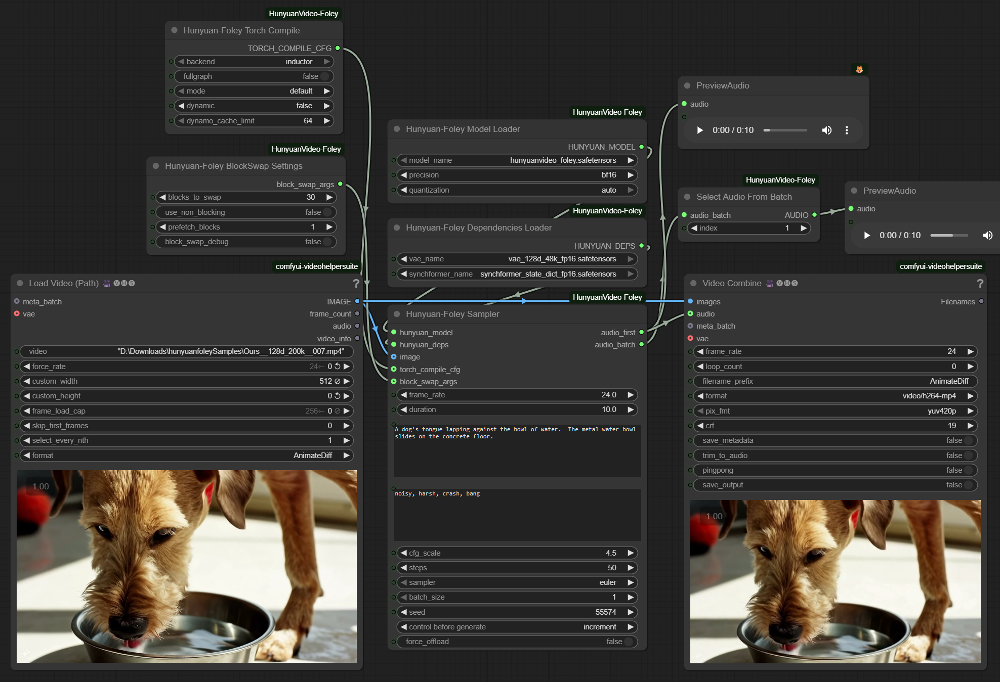

# 🎵 ComfyUI – HunyuanVideo‑Foley Video to Audio

### Troubleshooting (Windows CUDA)

- **Triton/Inductor cache errors** (e.g. FileNotFoundError in `%LOCALAPPDATA%\Temp\torchinductor_*`):
  - Use short cache paths and set allocator policy before launch:
    ```
    set TRITON_CACHE_DIR=C:\triton_cache
    set TORCHINDUCTOR_CACHE_DIR=C:\inductor_cache
    set PYTORCH_SDP_KERNEL=math
    set PYTORCH_CUDA_ALLOC_CONF=max_split_size_mb:64,garbage_collection_threshold:0.8
    ```
  - Optionally add these folders to Windows Defender Exclusions and enable long paths.
- **“addmm_cuda not implemented for 'Float8_e5m2'”**:
  - Use `Precision=fp16` and set `FP8 Quantization=None` in the Model Loader, or
  - (Repo default) FP8 is disabled unless explicitly requested. If you need FP8, set `HYF_FP8=1` before launch.
- **VRAM doesn’t drop after a run**:
  - The sampler now offloads models back to CPU and clears caches automatically after each run.

A tidy set of nodes for **Tencent HunyuanVideo‑Foley** that runs on modest GPUs and scales up nicely.

## ⚡ Optimized Models Available

**Pre-converted safetensors models with fp16 and fp8 variants are available for faster loading and reduced VRAM usage.** The fp8 models enable operation under 8GB VRAM, and with block swap, you can run under 4GB VRAM. [See model files section](#-where-to-put-the-model-files) for download links and file details.



## 🚀 Node overview (start here)

* **Hunyuan‑Foley Model Loader** – loads the main model. Two simple knobs:

  * **Precision**: runtime math quality (bf16/fp16/fp32).
  * **FP8 Quantization** (weight‑only): lowers VRAM usage < 12GB. *Turn this on if you're GPU‑poor.*
* **Hunyuan‑Foley Dependencies Loader** – loads DAC‑VAE, SigLIP2, Synchformer, and CLAP.
* **Hunyuan‑Foley Sampler** – makes the audio. Images are **optional** (works great as **Text→Audio**). Supports **negative prompt** and **batching**.
* **Hunyuan‑Foley Torch Compile** (optional) – uses `torch.compile` for speed. First run compiles; repeats are **\~30% faster**.
* **Hunyuan‑Foley BlockSwap Settings** (optional) – enables under 4GB VRAM operation by offloading transformer blocks to CPU.

## ⚡ Quick start

1. Drop **Model Loader → Dependencies Loader → (optional) Torch Compile → Sampler**.
2. For **Text→Audio**, leave the image input empty. For **Video→Audio**, connect an image sequence and set `frame_rate`.
3. Tweak **Prompt** and **Negative Prompt**. Leave sampler on **Euler**, `CFG≈4.5`, `Steps≈50`.
4. Press **Queue** and preview the audio.

## 📁 Where to put the model files


**Optimized safetensors files available at:**
[https://huggingface.co/phazei/HunyuanVideo-Foley](https://huggingface.co/phazei/HunyuanVideo-Foley) (converted safetensors with fp16 and fp8 variants)

I couldn't tell any difference between the quality with fp8 and fp16, so I'd suggest the 8.  For those on a 3090 and lower, torch compile will only work with the e5m2 file.

_Be sure to **set quantization on the loader node to auto or fp8** if using an fp8 model or it will be upcast to fp16 in memory_

**Converted safetensors files:**
```
hunyuanvideo_foley.safetensors             # ~10.3 GB  main model (fp16)
hunyuanvideo_foley_fp8_e4m3fn.safetensors  # ~5.34 GB  main model (fp8)
hunyuanvideo_foley_fp8_e5m2.safetensors    # ~5.34 GB  main model (fp8)
synchformer_state_dict_fp16.safetensors    # ~475 MB   sync encoder (fp16)
vae_128d_48k_fp16.safetensors              # ~743 MB   DAC‑VAE (fp16)
```

Place them in **`ComfyUI/models/foley/`**:

**Original files:**
Download from Hugging Face:
[https://huggingface.co/tencent/HunyuanVideo-Foley/tree/main](https://huggingface.co/tencent/HunyuanVideo-Foley/tree/main) (original PyTorch files)


```
hunyuanvideo_foley.pth         # ~10.3 GB  main model
synchformer_state_dict.pth     # ~0.95 GB  sync encoder
vae_128d_48k.pth               # ~1.49 GB  DAC‑VAE
```

> Tested with **PyTorch 2.7 and 2.8**.

## ⚙️ The Model Loader dropdowns

* **Precision** = how carefully the math runs. `bf16`/`fp16` are fast and standard; `fp32` is heaviest. Pick `bf16` (default) or `fp16` on 30‑series GPUs if you prefer.
* **FP8 Quantization** = store big Linear weights in **FP8** to save memory. Compute still runs in `Precision`, so sound quality holds.  (Must be selected for fp8 safetensors)

  * **`auto`** tries to match the checkpoint or uses a safe default.
  * Expect **less VRAM**, not more speed.

## 💾 Memory & speed at a glance

* Typical 5s / 50 steps on a 24 GB card:

  * Baseline: \~10–12 GB
  * With ping‑pong offloading (built‑in): \~9–10 GB
  * **With FP8 quant**: subtract another **\~4+ GB** (**under 8GB VRAM**)
  * **With Block Swap**: **under 4GB VRAM** It's slower the higher the swap, up to 60s for 5s, but it'll fit!
  * **Torch Compile**: after the first compile, runs are **\~30% faster**
* **Under‑12 GB recipe:** set **FP8 Quant** on, keep **batch\_size=1**, steps ≤ **50**. That's it.

## 🔄 Batching

* `batch_size` generates multiple variations at once. VRAM scales roughly with batch size.
* Use **Select Audio From Batch** to pick the clip you like.

## 💡 Tips & fixes

* If you OOM, drop `batch_size`, reduce `steps`, or enable **force\_offload** in the sampler.

## 🙏 Credits

* Model & weights: **Tencent HunyuanVideo‑Foley**.
* ComfyUI and community for the scaffolding.
* This repo adds VRAM‑friendly loading, **FP8** weight‑only option, **block swap** for ultra-low VRAM, and an optional **torch.compile** speed path.

